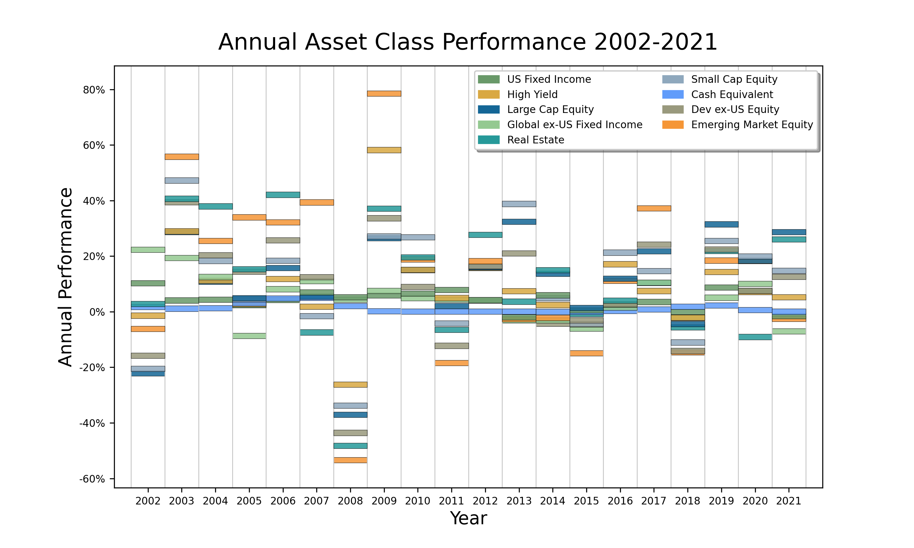
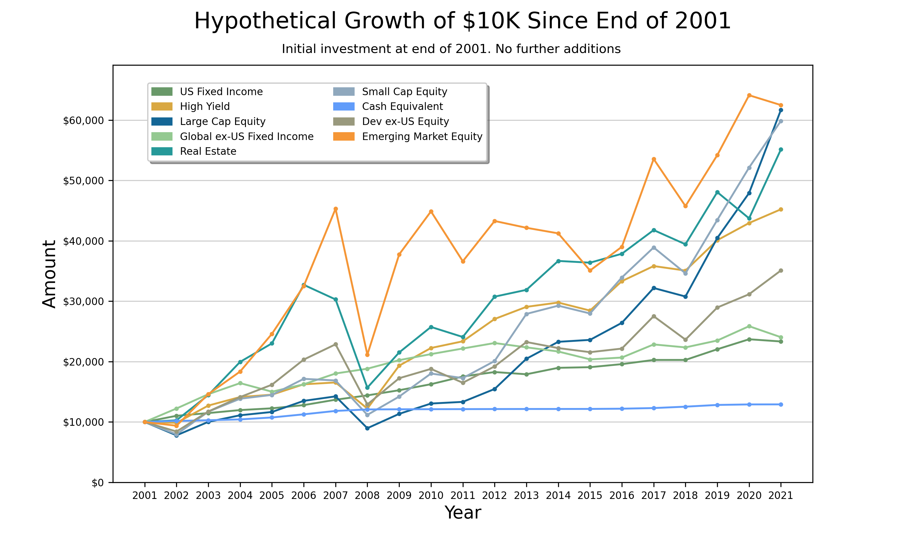
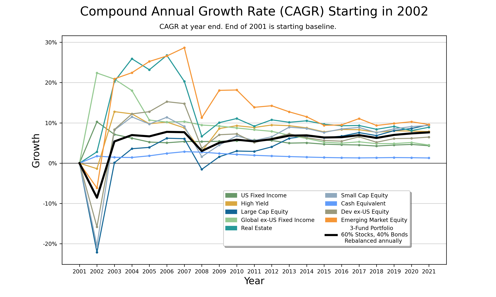

# Callan Chart

## Based on discussion of the "Callan Periodic Table of Investment Returns" on Bogleheads.org

Discussion: https://www.bogleheads.org/forum/viewtopic.php?f=10&t=336650

Background and data source: https://www.bogleheads.org/wiki/Callan_periodic_table_of_investment_returns

Callan Institute: https://www.callan.com/periodic-table/

## Asset class performance since 2000

## Alternate view of class performance since 2000
Same information as above, using lines instead of rectangles

## Hypothetical growth of initial $10K at end of 2000

## Hypothetical growth comparison with Boglehead three-fund portfolios

## Compound annual growth rate (CAGR) 2001-2020

## Compound annual growth rate (CAGR) comparison with Boglehead three-fund portfolios

## Display variations on asset class performance

### With highest and lowest of each year labeled...

### With trace lines...

### With highest/lowest and trace lines...

